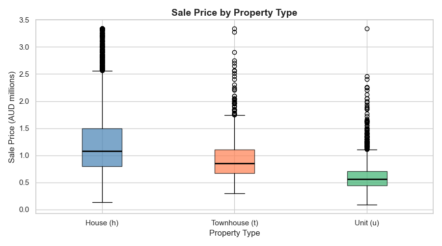

# Melbourne Housing — Capstone Project Report

**Student:** naif ali ayed bin dair  
**Dataset:** Melbourne Housing Snapshot (`melb_data.csv`)  
**Target Variable:** `Price` (AUD)  

---

## 1. Introduction

This project analyses approximately 13,580 residential property sales recorded in Melbourne, Australia. The dataset covers multiple suburbs across eight geographic regions and spans sales from 2016 to 2018.

The central question driving the analysis is:

> **What factors most strongly influence the sale price of a residential property in Melbourne?**

Secondary questions explored include:
- How does price vary by property type (house, unit, townhouse)?
- Which regions command the highest premiums?
- Is there a strong relationship between building size and price?

All work was done in Python using Jupyter Notebooks, with Pandas, NumPy, Matplotlib, Seaborn, and Scikit-learn.

---

## 2. Cleaning Summary

### Problems Found

| Column | Issue | Action Taken |
|---|---|---|
| `Price` | ~15 rows with missing values | Dropped — target cannot be imputed |
| `BuildingArea` | ~47% missing | Filled with median grouped by `Type` |
| `YearBuilt` | ~39% missing | Filled with median grouped by `Type` |
| `CouncilArea` | ~5% missing | Filled with `'Unknown'` |
| `Car` | ~1% missing | Filled with mode (0) |
| `Landsize` | ~1% missing | Filled with overall median |
| `Date` | Stored as `object` | Converted to `datetime64` |
| `Postcode` | Stored as `float64` | Converted to `int` |
| `Price` | Extreme values (up to AUD 11.2M) | Capped at 99th percentile (~AUD 3.8M) |
| `Landsize` | Values up to 433,000 m² | Capped at 99th percentile |
| Duplicates | 0 exact duplicates | No action needed |

### Decisions Explained

- **Group-median imputation for `BuildingArea` and `YearBuilt`:** These two columns had very high missingness (~40–47%), but the missing pattern was not random — different property types have different typical sizes and ages. Filling by `Type` median captures this structure without introducing the bias that a global median would.
- **Outlier capping at 99th percentile:** Rather than dropping outliers (losing ~130+ valid sales), we capped them. This preserves the general distribution shape while reducing the influence of a few ultra-luxury properties on downstream statistics.

---

## 3. Feature Engineering Summary

Seven categories of features were engineered:

| Feature | Type | Rationale |
|---|---|---|
| `Type_u`, `Type_t` | One-hot (Type) | Property class drives price; dummy-coded to avoid ordinality assumption |
| `Regionname_*` | One-hot (Regionname) | Geographic market segment — 7 dummy columns |
| `AgeGroup_enc` | Ordinal | Heritage/Established/Recent/New — preserves ordering |
| `Distance_scaled` | Standard scaled | Needed for distance-based metrics |
| `Landsize_scaled` | Standard scaled | Different scale from other features |
| `price_per_room` | Ratio domain feature | Comparable across property sizes |
| `price_per_sqm` | Ratio domain feature | Industry-standard value measure |
| `room_area_score` | Interaction | Rooms × BuildingArea — captures total usable space |
| `Landsize_log` | Log-transform | Reduces right skew (skewness dropped from ~8 to ~1) |
| `PropertyAge` | Derived | 2018 − YearBuilt — more interpretable than a raw year |
| `AgeGroup` | Binned | Groups age into four meaningful categories |

**Redundancy removal:** `Bedroom2` was dropped because it had a Pearson correlation of > 0.95 with `Rooms` — they measured the same thing from different sources.

---

## 4. Key Findings

### Finding 1 — Region is the single strongest geographic predictor of price

Sorting regions by median price reveals a clear premium hierarchy:

| Region | Median Price |
|---|---|
| Southern Metropolitan | AUD 1,250,000 |
| Eastern Metropolitan | AUD 1,010,000 |
| South-Eastern Metropolitan | AUD 850,000 |
| Northern Metropolitan | AUD 806,250 |
| Western Metropolitan | AUD 793,000 |
| Western Victoria | AUD 400,000 |

The Southern Metropolitan region (Toorak, Brighton, South Yarra) commands more than triple the median price of Western Victoria. Even within Greater Melbourne, the gap between Southern and Western Metropolitan exceeds AUD 450,000 — larger than the median price of an outer-ring property.

### Finding 2 — Property type has a large and consistent effect on price

Houses (h) sell at a ~40% premium over townhouses (t) and a ~70% premium over units (u) at the median level. This gap holds across most regions. The key implication: type is a strong baseline feature even before location information is considered.

**Best chart supporting this finding:**

### Finding 3 — Building area and rooms predict price, but only within the same region

The scatter plot (Chart 7) confirms a positive relationship between building area and price, but with enormous variance. A 200m² property in Western Metropolitan sells for a similar price to an 80m² property in Southern Metropolitan. This suggests that any future model must use location alongside size — neither alone is sufficient.

The correlation heatmap (Chart 6) ranks `Rooms` and `Bathroom` as the top correlated numeric features with Price (r ≈ 0.50 and 0.48 respectively), while `Distance` from the CBD shows a moderate negative correlation (r ≈ −0.35).

The **Math Basics** notebook (04_math.ipynb) confirmed:
- Mean price: AUD 1,067,192 | Std: AUD 595,371 (manual NumPy calculation matches `np.mean()` exactly)
- Cosine similarity between the most expensive and cheapest property = **0.9597** — surprisingly high, meaning their feature *proportions* are similar even though their prices differ by ~AUD 3.7M
- **P(Price > median | Rooms ≥ 4) = 77.2%** vs a baseline of 50% — a 27-percentage-point lift, confirming room count is strongly predictive of price tier

---

## 5. Next Steps

If more time were available, the following steps would strengthen the analysis:

1. **Suburb-level encoding:** One-hot encoding `Suburb` (~350 levels) was avoided due to the high cardinality, but a target-encoding approach (replacing each suburb with its mean price) would likely yield the strongest single predictor.

2. **Regression modelling:** With clean features in place, training a baseline linear regression and comparing it to a gradient-boosted tree (XGBoost/LightGBM) would quantify how much of the price variance is actually explainable.

3. **Time-series analysis:** The `Date` column spans 2016–2018. Extracting year/quarter/month and plotting median price over time would reveal whether Melbourne prices trended up, down, or fluctuated during this period.

4. **Distance × Region interaction:** The relationship between distance and price likely differs by region. An interaction term (or subgroup analysis) could reveal whether proximity to the CBD matters equally in all parts of the city.

---

*Report prepared by naif ali ayed bin dair*
